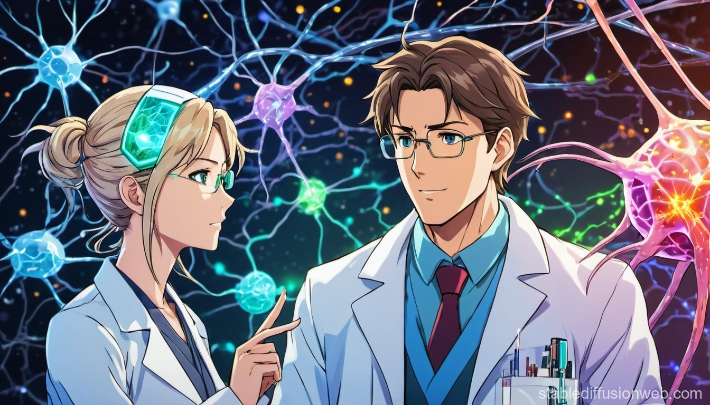

# vision-journal-club

Some resources for the Visual Neuroscience Group meetings. Restarted in 2024.

<figure>

  

<caption>How stable diffusion sees our vision journal club with some prompting</caption>
</figure>

Some materials for the lunchtime vision journal club - informal meeting - once every two weeks - at the [University of Nottingham](https://www.nottingham.ac.uk/psychology/).

## Github repo

You can find notes, presentations, and code at the [github repository](https://github.com/schluppeck/vision-journal-club).

## Schedule

| date            | Presenter   | Topic                                                     |
| --------------- | ----------- | --------------------------------------------------------- |
| Thurs 6 June 2024| Neil R, Denis  | Restart, NR: Effect of self-induced motion, presentation [[notes][initial-notes]] |
| Thurs 20 June 2024 | TBC  | |
| Thurs 4 July 2024 | Alan J | Motion. Models / psychophysics. |

[initial-notes]: ./presentations/2024-06-06-meeting.md 

## Code of conduct

We have a [code of conduct](./CODE-OF-CONDUCT.md) that applies to our meetings, emails, MS Teams, github discussion forum and other interactions. Please have a look at it.

## Ideas for meetings / wishlist

We will try to keep meetings informal with some guided discussion by presenters that will change week by week.

Structure will be around:

1. *I want answer the following question with my data... How do I do that?* and/or
2. *I know the following technique, which could help you with bla...*

## Colophon

Organised by Denis Schluppeck and others in the Visual Neuroscience Group, NG

**artwork by stable diffusion with some prompting** (https://stablediffusionweb.com)
